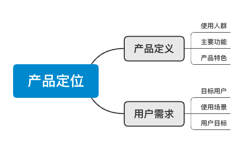
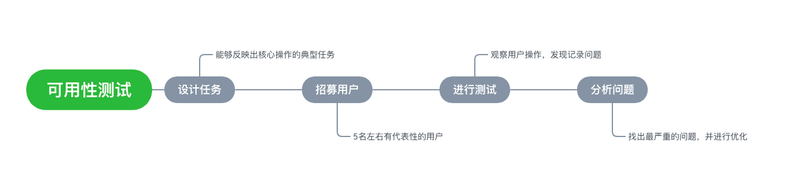
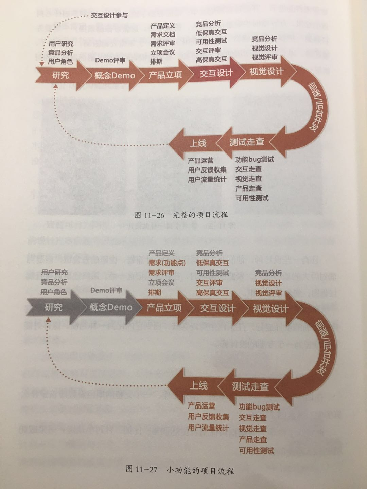

### 前言

曾经和公司的设计闲聊，她突然问：你知道我的 title 具体是啥嘛？我：设计？她：具体点，啥设计？我：UI？UX？她：UX。你知道 UI 和 UX 的差别么？UX 具体负责干啥你清楚嘛？

当时我不清楚，看完这本我大概知道了_(:з」∠)_交互设计真是了不起！很多职能我之前都误解了，以为是由产品负责，还想着好鸡肋的这岗位（喂

每一个对交互感兴趣的同学都可以抽空读一读这本，虽然有些老，但还挺好读ww

---

#### - 艺术是感性的，而设计是相对理性、精密的。艺术所表达的是创作者的个人意识，而设计是为了解决用户具体的问题

#### - 用户体验设计首先是要解决用户的某个实际问题，其次是让问题变得更容易解决，最后是给用户留下深刻的印象，让他在整个过程中产生美好的体验

#### + 用户体验的特征

* 严谨、理性、创意
* 提供特定问题的解决方案
* 不让用户思考
* 趣味横生

#### - 交互设计就是通过分析用户心理模型、设计任务流程、运用交互知识，把业务逻辑（功能规格或内容需求）以用户能理解的方式表达给用户，最终实现产品战略（公司需求和用户需求的最佳平衡点）的过程。这其实对交互设计师提出来更高的要求，即从公司战略角度去考虑问题，在满足公司需求的基础上让用户觉得易用、好用

#### - 平时多注重培养自己的思维和理念，而不是急于画图。多研究一些好的产品，思考人家这么做的原因，这些都是设计师日常必做的功课

#### - 做项目重要的是表述清楚自己的思路，而不是只展示设计结果

#### - 产品经理重大方向、商业目标、功能业务等，交互设计师重逻辑、细节、情感、创意、界面等

#### - 产品定位是产品设计的方向，也是需求文档和设计产出的判断标准。此外，产品定位也使团队成员形成统一的目标和对产品的认识，使团队更有凝聚力，使得沟通效率，工作效率得到了大大提升

#### - 需求文档应该包含产品定位、需求内容、需求优先级等，以及关于需求的详细描述说明

#### + 别被用户牵着走，理由

   1. 用户说的不一定是心中所想的（人本身是复杂的生物，思考和决策会受到多种因素的影响）
   2. 用户没有表达出自己的真实需求（人们所说出来的一般只是表面的想法，不一定能代表他们心中的真实诉求）
   3. 该用户不是你的目标用户
   4. 用户意见不一定专业

#### + 好的导航是成功的一半

* 导航的自我解释（明确的导航和位置信息）
* 深广度平衡（不要过多嵌套）
* 用户所需信息与商业推广信息的平衡
* 为重要功能和常用功能设置快捷入口

#### + 主要任务与次要任务

* 一个界面上如果铺放过多的功能或内容，会让用户迷茫且不知所措，效果反而会更差。因此，设计师需要站在用户的角度，做进一步的优先级筛选
* 排列任务优先级 （使用人数、使用频率、重要程度）

#### + 引导用户完成任务

   1. 相似性引导
   2. 方向性引导
   3. 运动元素引导
   4. 向导控件（stepper）

#### + 简化复杂的操作

* 减少冗余步骤和干扰项
* 将复杂操作转移给系统
* 简化操作方式
* 优化操作过程

#### + 信息量太大，页面怎么摆

* 让页面层次不言而喻
  1. 逻辑相关的在视觉上分为一组
  2. 内容或重要程度不同的在视觉上体现出差异
  3. 逻辑上有包含关系的在视觉上进行嵌套
* 让重点信息“跳出来”
* 将次要信息“藏起来”

#### + 标准原型应该包含的内容

   1. 简要说明与信息结构（例如变更日志，版本说明）
   2. 任务流程与页面流程
   3. 线框图 & 交互说明
      * 交互说明的主要类型
         1. 限制（包含范围值，极限值）
         2. 状态（包含默认状态，常见状态，特殊状态）
         3. 操作（包含常见操作，特殊操作，误操作，手势操作，反馈提示，动画等）

#### + 规范制定的时机

* 大型且重要的产品
* 产品结构、页面类型、UI组件相对较单一，可复用的内容较多
* 项目人手充足、时间较充裕
* 品牌风格、主题风格已确定完毕，品牌备忘和梳理势在必行
* 产品线日益丰富，后续设计一致性和可循环的要求被提高
* 产品结构壮大，新人不断涌入，沟通和执行效率急需提升

#### + 可用性测试

* 通过观察用户使用产品，发现产品中存在问题的一种方法

* 注意：
  1. 给出使用目标，而不是直接地操作
  2. 尽量选择最重要、最频繁的任务进行测试（时间 30 - 50 min，5 - 8 个功能点）
  3. 符合正常的操作流程

#### - 工作流程

